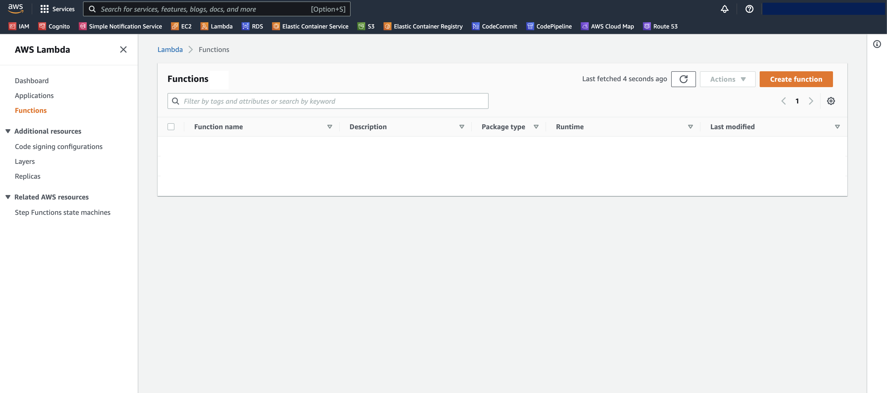
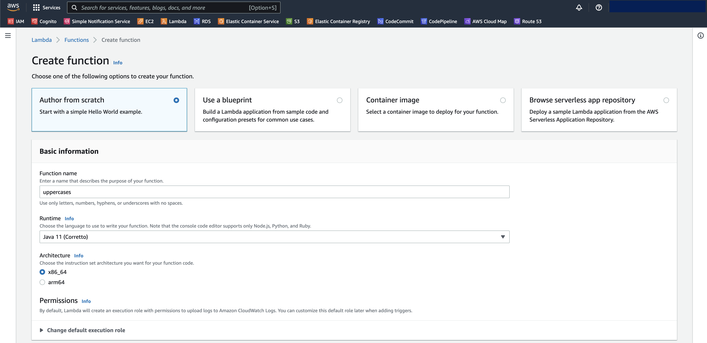
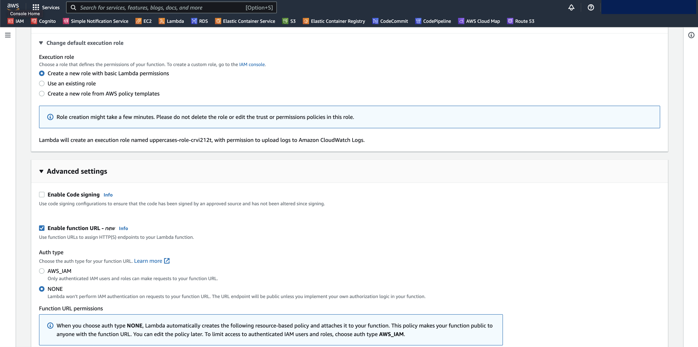
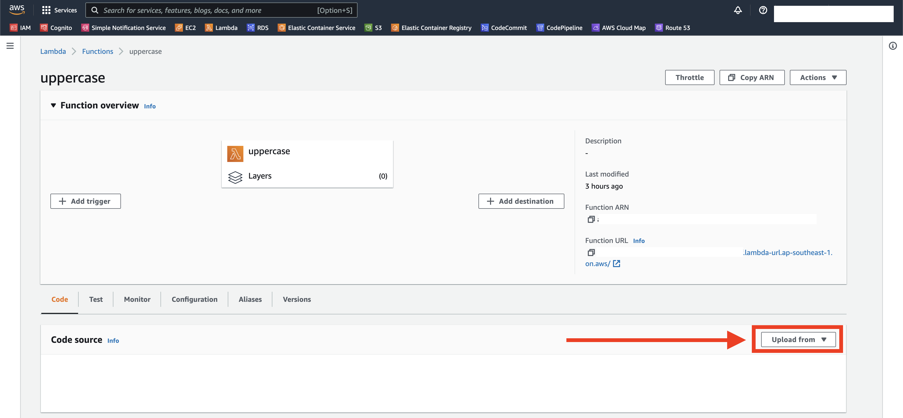
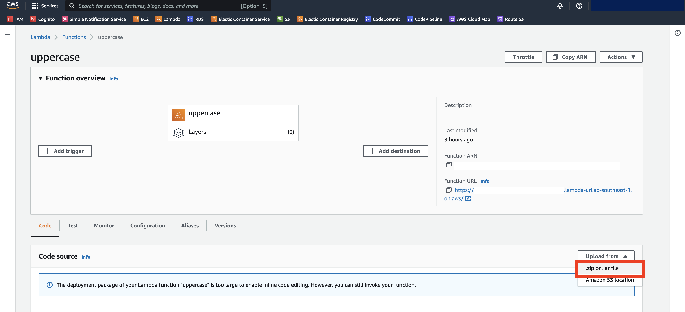
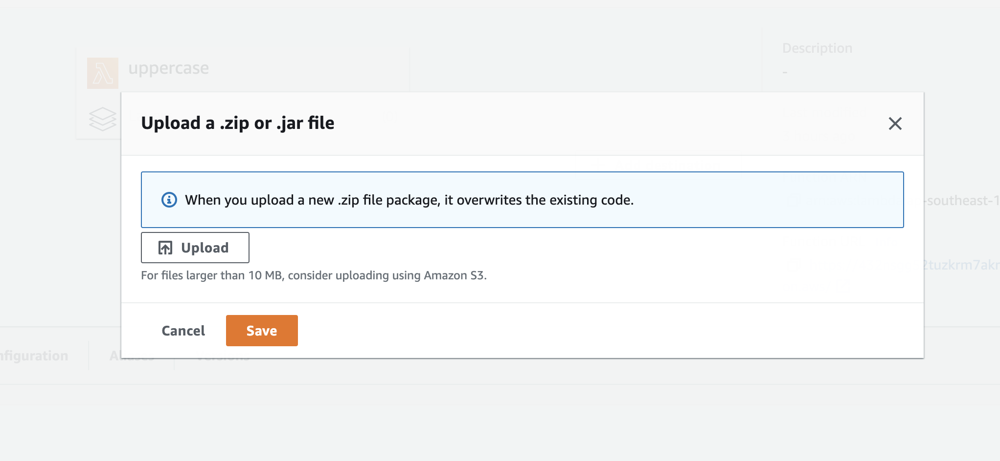
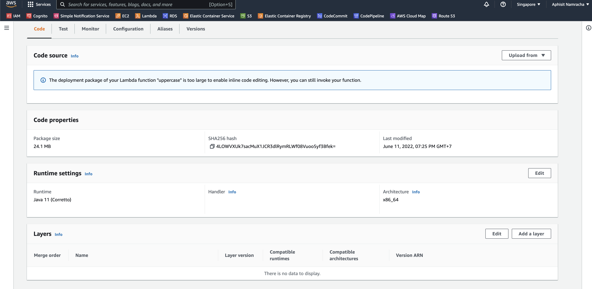
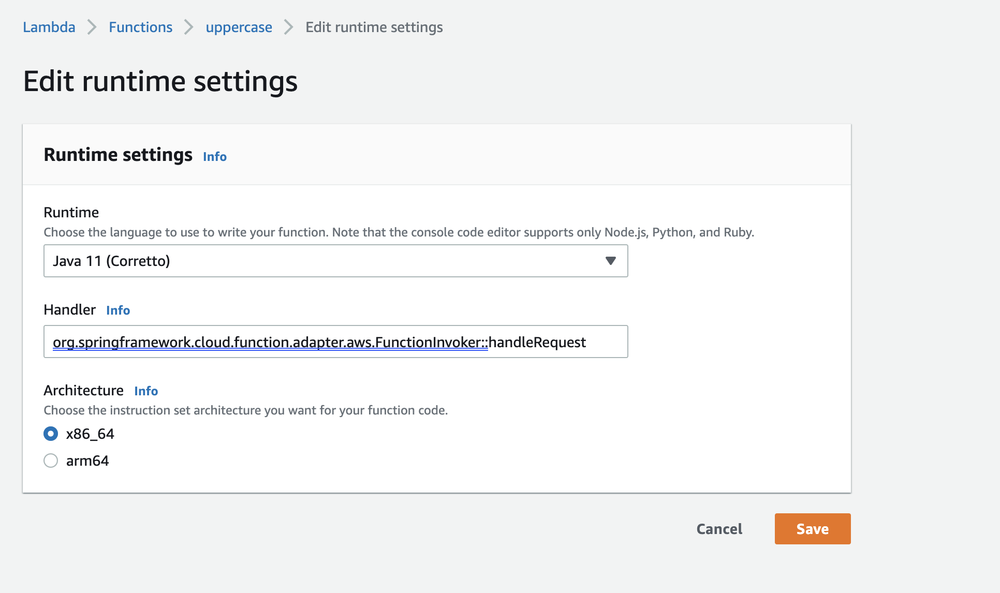
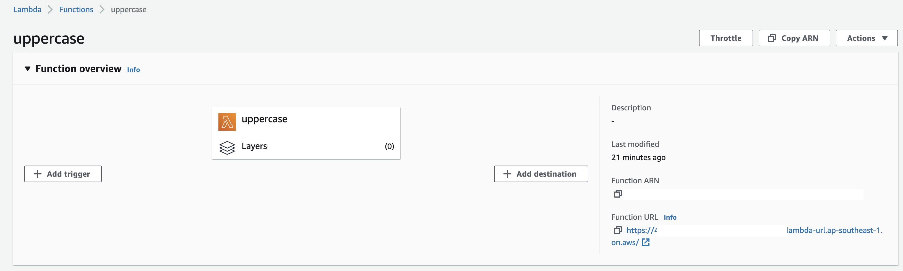
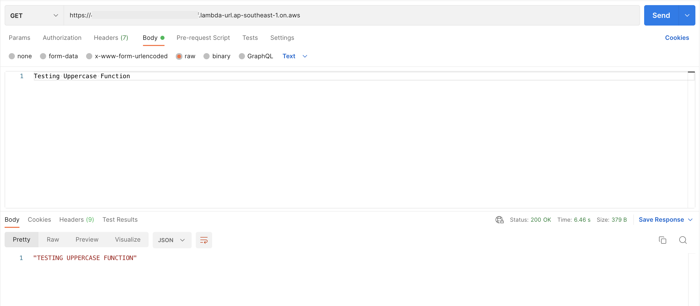

# Spring-Boot Lambda

### Build artifactory
```shell
./gradlew build -x test
```

### Create AWS Lambda
With AWS CLI
```shell
aws lambda create-function \
--function-name uppercase \
--role arn:aws:iam::[USERID]:role/service-role/[ROLE] \
--zip-file fileb://build/libs/spring-lambda.jar \
--handler org.springframework.cloud.function.adapter.aws.FunctionInvoker::handleRequest \
--runtime java11 --region ap-southeast-1 \
--timeout 30 --memory-size 1024 --publish
```

With AWS Console
1. Go to AWS Console and then choose Lambda services. Click Create function.
   
2. Create function by select Author from scratch and enter function name and select runtime to Java 11.
   
3. Expand Change default execution role and Advanced settings, then choose config
   following image below. And click Create function.
   
4. When create function success. Click upload from.
   
5. Choose .zip or .jar file.
   
6. Click upload file and choose file from project-directory/build/libs/spring-lambda.jar, then click save.
   
7. After upload file success. Click Edit at Runtime panel.
   
8. At Handler field, enter value `org.springframework.cloud.function.adapter.aws.FunctionInvoker::handleRequest`
   and click save.
   
9. Copy function URL from function overview page.
   
10. Open Postman and paste URL from (9). Use request body like image below. Then send Post request,
   You will see result from function.
   


### Test aws lambda function
```shell
aws lambda invoke \
--cli-binary-format raw-in-base64-out \
--function-name uppercase \
--payload file://request.txt \
response.json && cat response.json
```

Document reference
- https://docs.spring.io/spring-cloud-function/docs/current/reference/html/aws.html
- https://github.com/spring-cloud/spring-cloud-function
